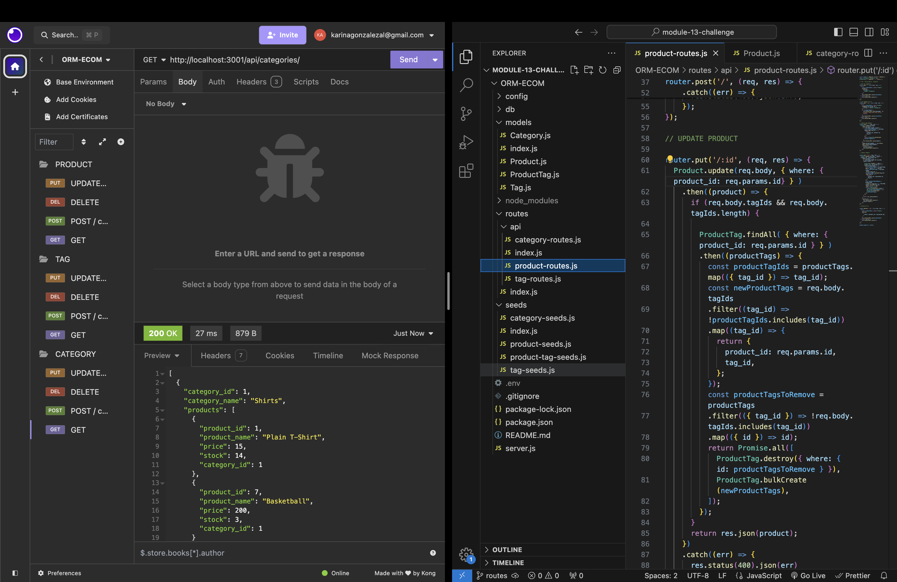

# ORM-ECOM

## Description

E-commerce is huge in the online shopping world! Learning how the backend of a an ecom store functions is critical to have to a fully functioning online store. Not only is it important the the page is visible pleasing to look at and easy to use, it is also very important that the inventory, pricing, and any other data is being stored, updated, added, and deleted as needed to make sure the store is current and up to date with the demands of customers. 

I learned how to effectivley use the CRUD method manipulate data. I learned how models are refencered to each other, how to create functions that allow for creating, reading, updating, and deleting data. 
I used Sequelize to configure a working Express.js API to interact with Postgres database.

## Installation

Install:

- Dotenv
- Express
- Postgres
- Nodemon (Optional)

## Usage

Clone repo into your computer and run npm install.
To use, run "node server.js" in the terminal, then open insomnia.
This should allow you create, read, update, and delete data.

## Credits

This was a starter code I modified to make it functional.

## How to Contribute

Email me: karinagonzalezal@gmail.com

Thank you! 